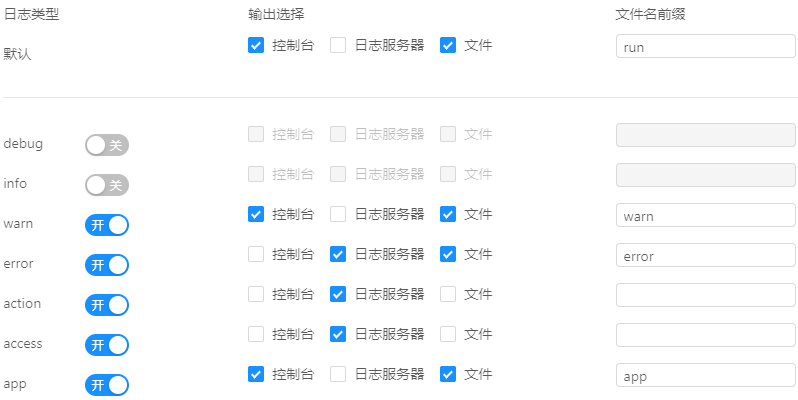

# 统一日志处理

---

UBSI为微服务的开发提供了一套完整的日志处理框架：

* 核心包的Consumer组件提供了Logger API
* 可以通过配置来指定日志输出的方式，包括：console、log-file、远程的日志服务
* 日志数据的"输出"是独立的后台任务通过异步方式进行批量处理，不影响正常任务的处理效率
* 可以通过独立部署的rewin.ubsi.logger日志微服务，来统一收集其他各处（包括微服务/应用等）产生的日志，并利用UBSI的日志工具进行分析
* 可以通过配置来指定对微服务的请求进行"跟踪"，服务容器/Consumer组件会自动产生相应的请求/处理日志，并利用UBSI的日志工具进行请求链路分析


以服务容器的一条"启动"日志为例（日志的默认配置是输出到console），看一下日志数据的格式：

```
[INFO]	2019-09-03 13:47:32.826	my-pc#7112	rewin.ubsi.container	rewin.ubsi.container	rewin.ubsi.container.Bootstrap#start()#138	startup	"my-pc#7112"
```

其中：

* [INFO]

  日志类型，其他还可以有：DEBUG(测试)、WARN(警告)、ERROR(错误)、ACTION(操作)、ACCESS(访问) 等，应用还可以使用自定义的类型，表示为：[APP#??]

* 2019-09-03 13:47:32.826

  产生日志的时间戳

* my-pc#7112

  输出日志的应用所在的位置

* rewin.ubsi.container

  应用的分类标签

* rewin.ubsi.container

  应用的ID

* rewin.ubsi.container.Bootstrap#start()#138

  日志输出语句所在的代码位置（类#方法#行号）

* startup

  日志的Tips提示（标题）

* "my-pc#7112"

  日志的详细内容（json格式字符串）


对于Consumer应用，可以通过 `Context.getLogger()` 获得Logger对象；对于微服务，应该使用 ServiceContext对象的 `getLogger()` 来获得Logger对象。


Logger对象产生的日志可以通过UBSI Web管理器的日志配置工具设置"输出"方式：




* 不需要输出的日志可以通过配置"关闭"即可，不需要再去变更日志生成的代码
* 需要进行统计分析或"跟踪"的日志，可以"输出"到UBSI的日志微服务(rewin.ubsi.logger)，然后通过Web管理器的日志工具进行分析


如果未部署Web管理器，也可以手工创建日志配置文件rewin.ubsi.log.json：

```
{
  "options": {
    "all": {
      "output": 3,
      "filename": "run"
    },
    "debug": {
      "output": 0
    },
    "info": {
      "output": 0
    },
    "warn": {
      "output": 3,
      "filename": "warn"
    },
    "error": {
      "output": 6,
      "filename": "error"
    },
    "action": {
      "output": 4
    },
    "access": {
      "output": 4
    },
    "app": {
      "output": 3,
      "filename": "app"
    },
  }
}
```

