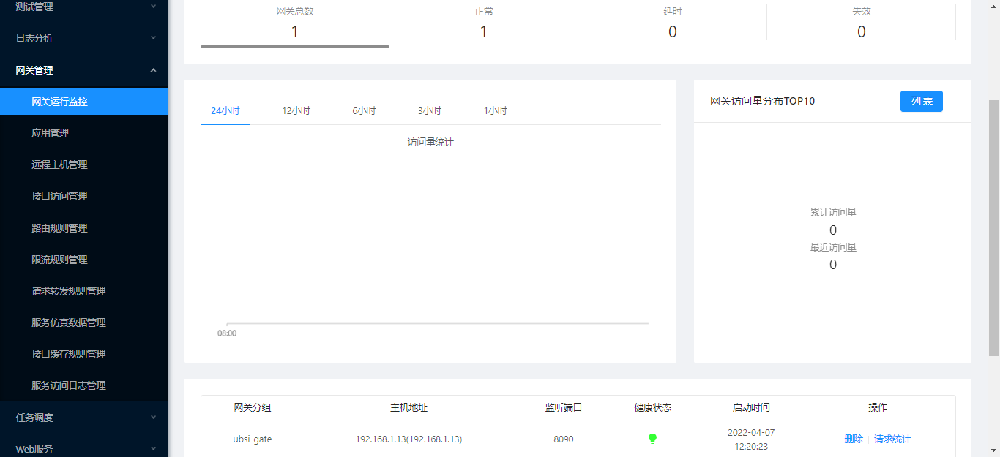

# API网关

---

在复杂的企业IT系统环境中，各种不同的业务系统（应用）可能是用不同的技术方案（异构）独立建设的，但是由"微服务"所代表的核心业务逻辑在应用之间应该是一致并且可以被"共享"的。在这种环境下，"微服务"已经不再仅仅是单一应用内的架构模式，而是可以成为企业内保障关键业务能力的"中台"系统。

UBSI API Gateway为企业内的各种异构应用访问"微服务"提供了"统一"的接口及管控机制，逻辑架构如下：

API Gateway本身是一个基于SpringBoot的Web服务，向外围应用提供restful风格的api，使其能够访问"后端"的微服务。API Gateway支持：

* 应用的认证/鉴权
* 多实例部署
* 集中策略配置
* 实例可以分组，并分别配置不同的访问策略

UBSI Web管理器通过基础微服务"rewin.ubsi.gateway"来配置API Gateway的访问策略，rewin.ubsi.gateway将策略存储在MongoDB中，并在策略发生变化的时候，通过redis广播机制通知各个API Gateway的运行实例。

API Gateway支持的访问策略包括：

* 按照应用/网络地址进行访问权限控制
* 配置访问路由，实现服务隔离、版本选择等
* 对服务进行访问流量控制
* 将访问流量"分流"或"镜像"到其他API Gateway
* 对指定的服务接口进行结果缓冲或仿真，实现服务降级

另外，通过UBSI Web管理器还可以做到：

* 对外围应用进行注册
* 对API Gateway的运行实例进行实时监控
* 对特定服务的请求记录访问日志
* 对访问日志进行统计分析

