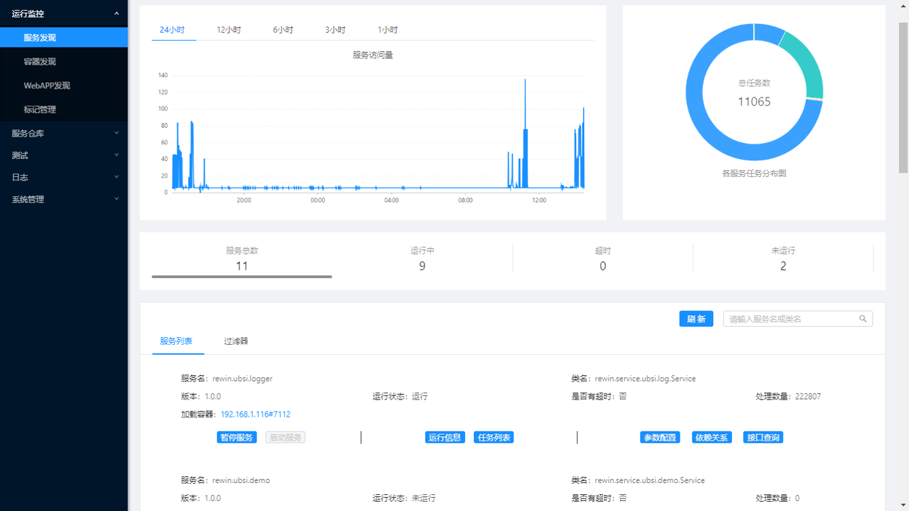
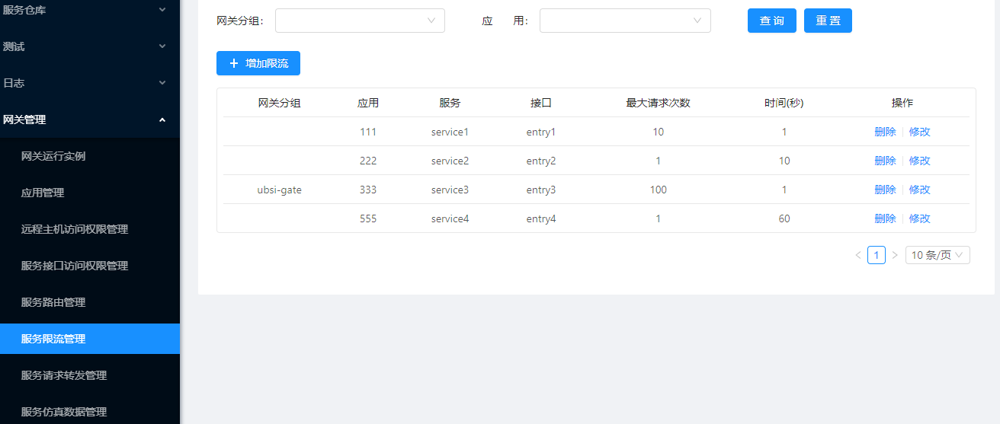

# 治理工具

---

UBSI平台提供了一个功能相对完整的基于web的监控管理工具：

### 运行监控

* "发现"运行的服务容器及微服务
* 容器/微服务的运行状态、请求计数及健康状态
* 正在处理的服务请求，超时警报
* 容器的访问权限、运行参数、服务路由、日志参数的动态配置
* 微服务的接口发现
* 微服务的状态管理：启用/停用、卸载等
* 微服务运行参数、服务依赖的动态配置
* [Web应用](../webapp/readme.md)的发现及配置

### 服务仓库

* Java发行包管理
* 微服务的注册管理
* 微服务接口文档
* 微服务新版本发现
* 微服务部署
* 微服务缺省配置
* 微服务接口仿真

### 服务测试

* 功能测试/性能测试
* 测试脚本
* 测试方案
* 测试结果

### 服务日志

* 服务请求的统计分析
* 服务请求的全链路跟踪分析
* 服务运行日志查询

### API网关的配置

* 应用注册，访问权限
* 路由配置，服务隔离
* 限流/熔断，分流/镜像
* 缓冲/仿真，服务降级
* 请求统计，请求日志

> *更多说明请参见：[API网关](../gateway/readme.md)*

### 服务编排及调度

待补充

---
> **获得管理工具请参见：[Web管理器](../deploy/admin.md)**

