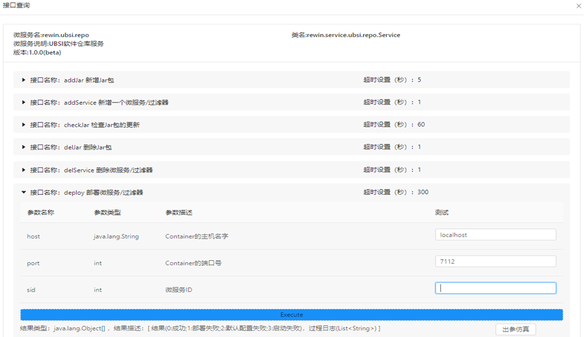
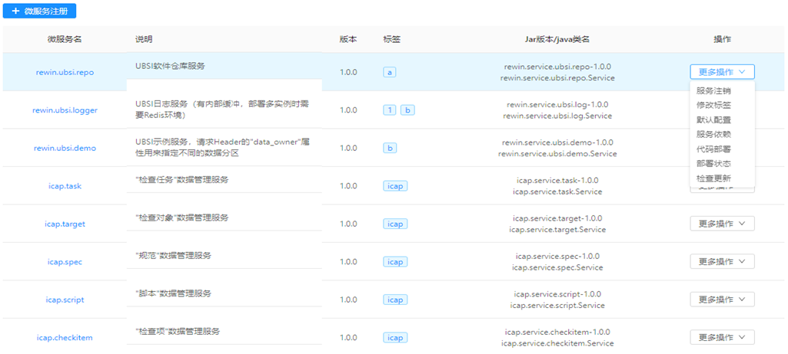
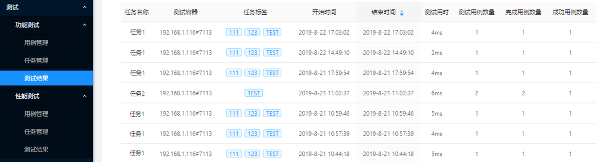

# 开发及交付

---

UBSI力图使微服务的开发更加简单，利用UBSI提供的框架和工具，开发者能够更加专注与微服务本身的功能设计及实现，而不必过多关注底层以及运行/监控需要的技术实现。

### 服务声明

UBSI目前只支持纯Java技术栈（需要JavaSE8+），开发者需要使用UBSI定义的[服务注解](../develop/annotation.md)来声明自己的微服务及接口，UBSI的服务发现工具能够直接使用注解中的说明形成接口文档：

### 服务仓库

UBSI建议开发者使用maven管理自己的微服务项目，并且将构建后的package发布到自己的仓库repository中。UBSI的服务仓库工具能够从maven仓库中“发现”并管理微服务的各个版本，还能够直接将微服务部署到某个服务容器中。

> 微服务不仅仅是用来满足应用内架构分层或业务解耦的需要，更应该是组织内多个应用之间可以共享的软件资产，所以UBSI的治理工具在关注微服务运行实例的同时，也将微服务作为“资产”进行管理，内容包括微服务的发行包、缺省配置以及接口说明等。

### 灰度发布

微服务在开发迭代过程中会形成多个版本，在运行环境中，可以同时部署微服务不同版本的实例（不能在同一个服务容器中）。UBSI的路由算法可以根据服务名字、版本及发行状态进行路径选择，通过动态配置路由表，可以非常容易地支持在新版本上线时进行“灰度”发布：

* 限定所有流量到旧版本
* 将某个旧版本实例替换部署为新版本
* 对新版本进行自动化测试
* 释放部分流量到新版本，进行在线测试
* 替换其他所有旧版本 或 回退

### 自动化测试

UBSI也提供了一个简单的微服务自动化测试工具，包括功能测试和性能测试：

---
特别提示：

UBSI目前只支持Java环境，其他异构系统如果需要访问UBSI微服务，可以通过[API网关](../gateway/readme.md)提供的Restful服务接口进行转发。

