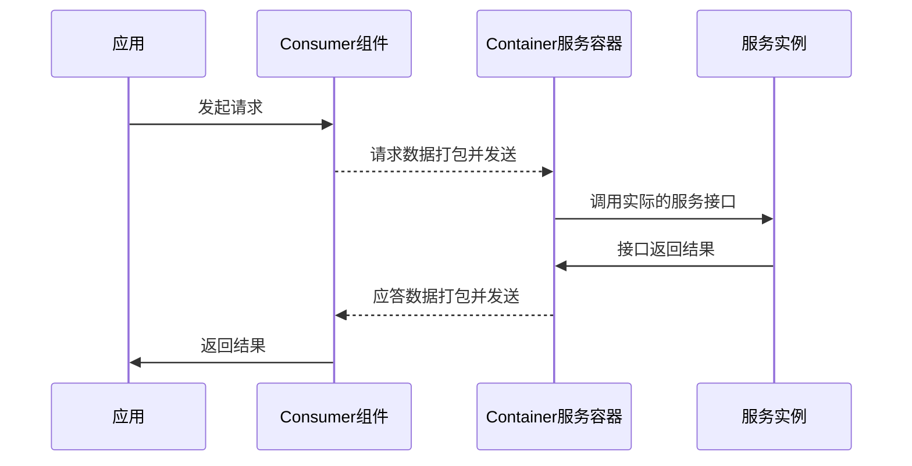

# 注册及发现

---

UBSI实现了完备的“服务注册/服务发现/服务访问”机制：

- 服务注册

  采用redis作为注册中心，UBSI的Container服务容器负责定时将各个服务实例的位置、状态、访问计数等数据更新到redis中，同时利用redis的publish/subscribe机制发布容器的"活动心跳"以及各服务实例的状态变化等消息。

  注册中心的高可用性通过redis的群集部署方案来保障。

- 服务发现 / 服务路由

  UBSI的Consumer组件通过redis的服务注册数据以及状态消息来构建本地的“动态”服务路由，当有服务请求时，通过路由算法将请求发送到合适的服务实例上。

  Consumer组件能够动态跟踪各个服务实例的状态变化，能够发现各服务容器的健康状态以及负载情况，路由算法可以做到隔离故障并且按照“响应能力越强则选中概率越高“的机制选择合适的服务实例。

- 服务访问

  UBSI服务请求的处理流程如下：

&nbsp;

为保证更高的处理性能和数据传输效率，Consumer与Container之间采用基于长链接的多路复用机制，并使用"语言无关"的特定二进制格式对请求/应答数据进行打包编码（[UBSI Protocol](protocol.md)）。

---

特别提示：

UBSI支持"简易"的部署模式，不需要redis注册中心也能够正常运行。这种模式下需要手工配置Consumer组件的"静态"路由表。UBSI的静态路由算法同样能够做到：
- 按权重分配负载
- 节点的故障检测、隔离及恢复

